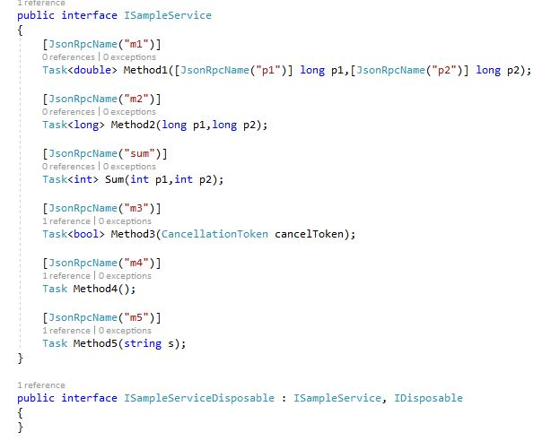
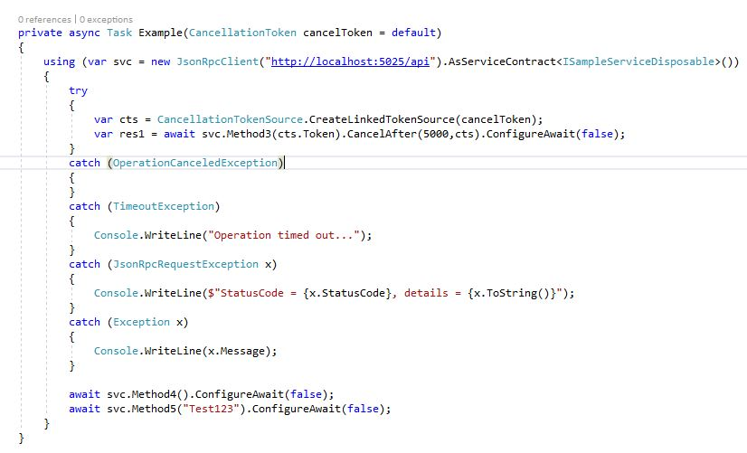
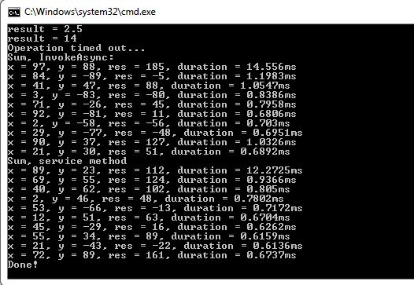
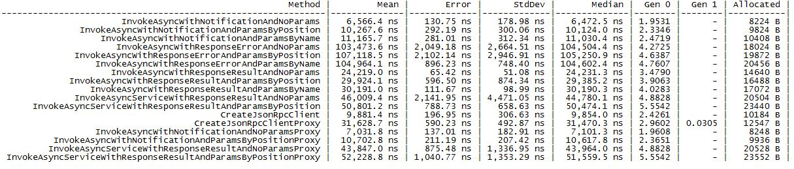

# JsonRpc.ServiceClientProxy
JSON-RPC 2.0 strongly-typed service client proxy for .NET Standard / .NET Core (based on Community.JsonRpc.ServiceClient)

See Community.JsonRpc.ServiceClient for details:
https://github.com/alexanderkozlenko/json-rpc-client

### Limitations
- The proxy does not support parameters by name.

### Usage:
See the sample projects for details.

### Benchmarks

